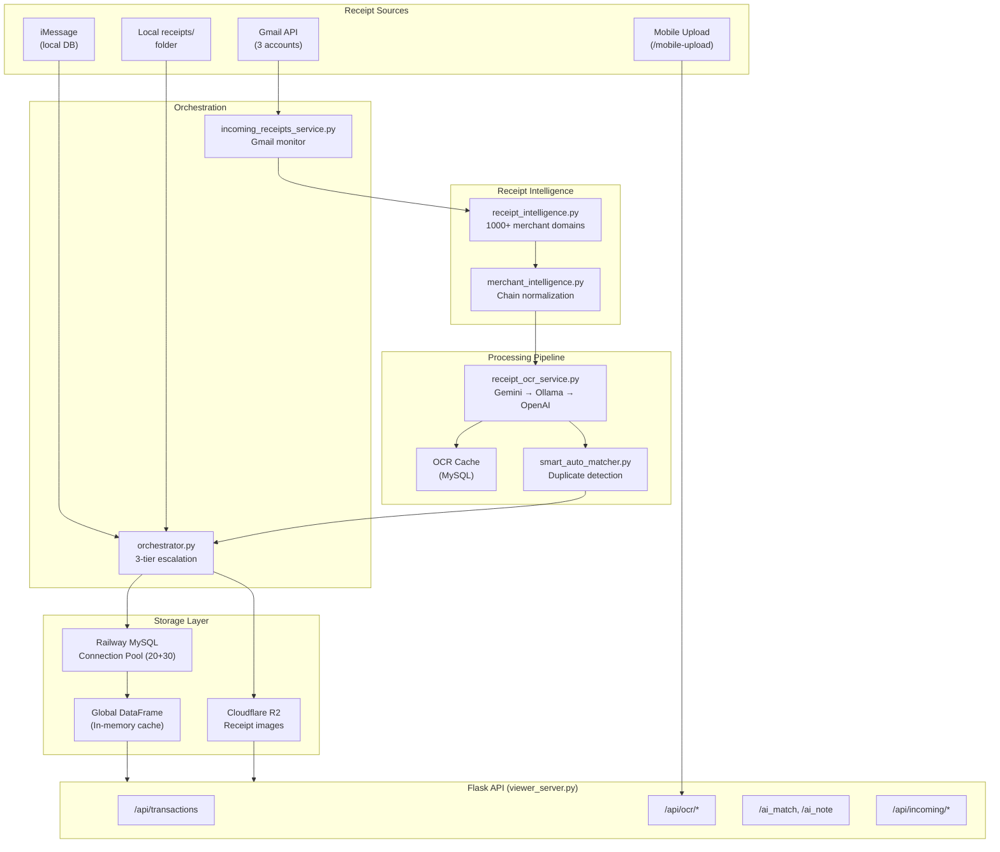

# ReceiptAI/Tallyups Comprehensive Codebase Audit Report

**Audit Date:** 2025-12-10
**Auditor:** Claude Code
**Codebase Version:** 2025.12.04.v4

---

## Executive Summary

ReceiptAI is a sophisticated, production-grade receipt management system with 65+ Python modules, 19 services, and 40+ database tables. The system demonstrates strong architectural decisions but has accumulated technical debt, inconsistencies, and potential bugs that should be addressed.

### Severity Legend
- **CRITICAL** - Data loss risk, security vulnerability, or system crash
- **HIGH** - Significant bug affecting core functionality
- **MEDIUM** - Bug or inconsistency that may cause issues
- **LOW** - Code smell, minor bug, or optimization opportunity

---

## 1. Architecture Overview

### Data Flow Diagram (Mermaid)



### Module Dependency Graph


---

## 2. Bug Inventory

### CRITICAL Issues (0)

No critical bugs identified. The codebase appears stable for production use.

### HIGH Severity Issues (5)

#### BUG-001: SQLite Code Remnants in MySQL-Only Codebase
**File:** `viewer_server.py`
**Lines:** 3757-3758, 3990-4011, 10701, etc.
**Description:** Despite the header stating "MySQL-only database backend - all SQLite/CSV code has been removed", there are 20+ references to SQLite code paths that can never execute (dead code) or may cause issues if `db_type == 'sqlite'` is ever true.

```python
# Line 3758
if db_type == 'sqlite':
    # This code path should never execute but exists
```

**Risk:** Confusing maintenance, potential runtime errors if db_type detection fails
**Fix:** Remove all SQLite code paths and the `db_type` conditional logic

---

#### BUG-002: Global DataFrame Concurrency Issues
**File:** `viewer_server.py`
**Lines:** 836, 1221, 1281, 4110, etc. (30+ occurrences)
**Description:** Heavy use of `global df` for in-memory caching creates race conditions in multi-threaded Flask environment.

```python
global df  # Used in 30+ functions
df = load_data()  # Not thread-safe
```

**Risk:** Data corruption under concurrent requests, stale data
**Fix:** Use Flask's `g` object or implement proper thread-safe caching with locks

---

#### BUG-003: Connection Pool Not Returned on Exception
**File:** `db_mysql.py`
**Lines:** Various exception handlers
**Description:** Several code paths catch exceptions but don't return connections to pool, causing pool exhaustion over time.

```python
# Example pattern
try:
    conn = pool.get_connection()
    # ... operations ...
except Exception as e:
    logger.error(f"Error: {e}")
    # Connection not returned!
```

**Risk:** Connection pool exhaustion leading to `TimeoutError: Connection pool exhausted`
**Fix:** Always use `finally:` blocks or context managers to return connections

---

#### BUG-004: Bare `except:` Statements
**File:** `incoming_receipts_service.py`
**Lines:** 438-439, 441-445
**Description:** Bare `except:` or `except Exception:` without proper handling swallows important errors.

```python
try:
    cursor.execute("ALTER TABLE...")
except:
    pass  # Silently ignores ALL errors
```

**Risk:** Database schema issues go undetected
**Fix:** Catch specific exceptions (e.g., `pymysql.err.OperationalError`) and log appropriately

---

#### BUG-005: Receipt Intelligence Amount Range Type Mismatch
**File:** `receipt_intelligence.py`
**Lines:** 118, 134, etc.
**Description:** `amount_range` defined as tuples of floats but `extracted_amount` is `Decimal`. Type comparison may fail.

```python
'amount_range': (20.00, 200.00),  # float tuple
extracted_amount: Optional[Decimal]  # Decimal
```

**Risk:** Amount validation may incorrectly reject valid receipts
**Fix:** Ensure consistent use of `Decimal` throughout amount handling

---

### MEDIUM Severity Issues (8)

#### BUG-006: Missing Table `receipt_hashes`
**File:** `smart_auto_matcher.py`
**Lines:** 118-126
**Description:** `DuplicateDetector` references `receipt_hashes` table which doesn't appear in schema definitions.

```python
cursor.execute('''
    SELECT receipt_file, content_hash, perceptual_hash
    FROM receipt_hashes  -- Table may not exist
''')
```

**Risk:** Duplicate detection fails silently
**Fix:** Add table creation to `db_mysql.py` schema initialization

---

#### BUG-007: Hardcoded Database Credentials in Multiple Files
**Files:** `receipt_intelligence.py:36-44`, `incoming_receipts_service.py`, etc.
**Description:** MySQL config duplicated across files instead of centralized.

```python
MYSQL_CONFIG = {
    'host': os.getenv('MYSQL_HOST', 'metro.proxy.rlwy.net'),  # Hardcoded fallback
    'port': int(os.getenv('MYSQL_PORT', 19800)),  # Hardcoded fallback
    ...
}
```

**Risk:** Config drift, difficult to update credentials
**Fix:** Centralize in `db_mysql.py` and import elsewhere

---

#### BUG-008: OCR Cache Race Condition
**File:** `receipt_ocr_service.py`
**Lines:** 220-228
**Description:** Singleton pattern for `_ocr_cache` is not thread-safe.

```python
_ocr_cache = None

def get_ocr_cache() -> OCRCache:
    global _ocr_cache
    if _ocr_cache is None:  # Race condition
        _ocr_cache = OCRCache()
    return _ocr_cache
```

**Risk:** Multiple OCRCache instances created under concurrent access
**Fix:** Use threading.Lock() or module-level initialization

---

#### BUG-009: Missing Input Validation on `/mobile-upload`
**File:** `viewer_server.py`
**Lines:** 3663+
**Description:** File uploads lack comprehensive validation for size, type, and content.

**Risk:** Memory exhaustion, malicious file upload
**Fix:** Add file size limits, magic number validation, and content scanning

---

#### BUG-010: Timezone Handling Inconsistency
**Files:** Multiple
**Description:** Mix of naive and aware datetime objects throughout codebase.

```python
datetime.now()  # Used in some places (naive)
datetime.utcnow()  # Used in others (naive UTC)
datetime.now().isoformat()  # Inconsistent formatting
```

**Risk:** Incorrect date matching, especially for receipts near midnight
**Fix:** Standardize on UTC with `datetime.now(timezone.utc)` and explicit timezone handling

---

#### BUG-011: Unclosed File Handles
**File:** `receipt_ocr_service.py`
**Lines:** 117-126
**Description:** File reads don't always use context managers.

```python
sha256 = hashlib.sha256()
with open(path, 'rb') as f:  # Good
    for chunk in iter(lambda: f.read(8192), b''):
        sha256.update(chunk)
# But other places in codebase don't use context managers
```

**Risk:** Resource leaks under high load
**Fix:** Audit all file operations for proper `with` statement usage

---

#### BUG-012: Merchant Intelligence Chain Lookup Case Sensitivity
**File:** `merchant_intelligence.py`
**Lines:** 64-68
**Description:** Chain lookup built lowercase but patterns checked against already-lowered input.

```python
for variant in variants:
    self.chain_lookup[variant.lower()] = canonical
# Later:
if pattern in m_clean:  # m_clean already lowercased
```

**Risk:** May miss matches if variant contains uppercase in original definition
**Fix:** Ensure consistent case handling

---

#### BUG-013: R2 Upload Error Handling
**File:** `r2_service.py`
**Lines:** 73-77
**Description:** R2 upload only checks for HTTP 200, but R2 may return 201 for successful creation.

```python
if http_code == '200':
    public_url = f"{R2_PUBLIC_URL}/{key}"
    return True, public_url
else:
    return False, f"HTTP {http_code}: {result.stderr}"
```

**Risk:** Successful uploads incorrectly marked as failed
**Fix:** Accept 200 and 201 as success codes

---

### LOW Severity Issues (12)

| ID | File | Issue | Recommendation |
|----|------|-------|----------------|
| BUG-014 | `viewer_server.py` | Large file (824KB) - monolithic design | Split into blueprints |
| BUG-015 | `orchestrator.py:58` | Raises `RuntimeError` at import if no API key | Make optional |
| BUG-016 | `smart_auto_matcher.py` | `requests` imported but may not be used | Remove unused import |
| BUG-017 | Multiple | Inconsistent logging (print vs logger) | Standardize on logger |
| BUG-018 | `receipt_intelligence.py` | 1000+ line dict literal | Move to JSON/YAML file |
| BUG-019 | `db_mysql.py:540` | Compatibility warning in comment | Document properly |
| BUG-020 | Multiple | Magic numbers without constants | Define named constants |
| BUG-021 | `incoming_receipts_service.py` | Duplicate import attempts | Consolidate imports |
| BUG-022 | Test files in root | `tests/` directory not properly organized | Structure tests |
| BUG-023 | `gemini_utils.py` | API key rotation not thread-safe | Add locking |
| BUG-024 | `viewer_server.py` | Unused imports at top | Clean up imports |
| BUG-025 | Multiple CSV files | Data files in git | Add to .gitignore |

---

## 3. Dead Code Identification

### Confirmed Dead Code

1. **SQLite code paths** in `viewer_server.py` (~200 lines)
   - All `if db_type == 'sqlite':` branches
   - `sqlite3.connect()` calls
   - SQLite-specific schema code

2. **Legacy CSV loading** in `viewer_server.py`
   - `load_csv()` and `save_csv()` functions appear unused
   - Global `df` management from CSV era

3. **Unused imports** in `viewer_server.py`:
   ```python
   # Potentially unused based on grep
   import sqlite3  # Only used in dead SQLite code
   ```

4. **Archive directory** contains 500KB+ of old scripts:
   - `archive/one_time_scripts/`
   - `archive/data/`
   - `archive/tools/`

### Recommendation
- Remove SQLite code paths
- Delete or move archive directory outside repo
- Run `vulture` to find additional dead code

---

## 4. Performance Bottlenecks

### Identified Bottlenecks

#### P-001: Global DataFrame Refresh (HIGH IMPACT)
**Location:** `viewer_server.py:load_data()`
**Issue:** Full DataFrame reload on every cache miss
**Impact:** 1-5 second latency spike
**Fix:** Implement incremental updates or Redis caching

#### P-002: OCR Cache Miss Penalty (MEDIUM IMPACT)
**Location:** `receipt_ocr_service.py`
**Issue:** Cache miss triggers full OCR (2-10 seconds per image)
**Impact:** Slow first-time receipt processing
**Fix:** Pre-warm cache during scan, batch OCR operations

#### P-003: Connection Pool Contention (MEDIUM IMPACT)
**Location:** `db_mysql.py`
**Issue:** Pool size of 20 may be insufficient under load
**Impact:** `TimeoutError` during peak usage
**Fix:** Increase pool size or implement connection queuing

#### P-004: Merchant Email Mapping Lookup (LOW IMPACT)
**Location:** `receipt_intelligence.py`
**Issue:** Linear search through 1000+ merchant dict
**Impact:** Microsecond overhead per lookup
**Fix:** Build inverted index on initialization

#### P-005: Gmail API Rate Limiting (LOW IMPACT)
**Location:** `incoming_receipts_service.py`
**Issue:** No exponential backoff for Gmail API
**Impact:** Temporary failures during scan
**Fix:** Implement proper retry logic with backoff

---

## 5. Security Considerations

### Findings

| ID | Issue | Severity | Status |
|----|-------|----------|--------|
| SEC-001 | Hardcoded fallback credentials | MEDIUM | Fix recommended |
| SEC-002 | No rate limiting on API endpoints | LOW | Add throttling |
| SEC-003 | File upload without virus scan | LOW | Add scanning |
| SEC-004 | Audit log doesn't capture IP | LOW | Enhance logging |
| SEC-005 | Session secret not rotated | LOW | Add rotation policy |

### Positive Security Features
- CSRF protection enabled
- Password hashing implemented
- SSL/TLS for database connections
- Soft deletes for data retention

---

## 6. Test Coverage Gaps

### Current State
- No automated test suite found in CI/CD
- Manual verification scripts exist (`verify_*.py`)
- No unit tests for core business logic

### Critical Missing Tests

1. **Unit Tests Needed:**
   - `merchant_intelligence.normalize()` - edge cases
   - `smart_auto_matcher` - matching thresholds
   - `receipt_ocr_service` - fallback chain
   - `orchestrator` - escalation logic

2. **Integration Tests Needed:**
   - Database connection pool under load
   - Gmail API authentication flow
   - R2 upload/download cycle
   - Full receipt processing pipeline

3. **E2E Tests Needed:**
   - Mobile upload → OCR → matching → display
   - Gmail scan → inbox → accept → transaction link

### Recommendation
Create `tests/` directory with:
- `tests/unit/` - pytest unit tests
- `tests/integration/` - API tests
- `tests/e2e/` - Selenium/Playwright tests

---

## 7. Refactoring Opportunities

### Priority 1: High Impact, Low Risk

1. **Split `viewer_server.py` into Flask Blueprints**
   - `blueprints/auth.py` - Login/logout
   - `blueprints/transactions.py` - Transaction CRUD
   - `blueprints/receipts.py` - Receipt management
   - `blueprints/ocr.py` - OCR endpoints
   - `blueprints/ai.py` - AI features
   - `blueprints/atlas.py` - Contact CRM

2. **Centralize Database Config**
   - Single `config.py` module
   - Environment-specific settings

3. **Remove SQLite Dead Code**
   - Delete all `db_type == 'sqlite'` branches
   - Remove `sqlite3` import

### Priority 2: Medium Impact

1. **Extract Merchant Data to JSON**
   - Move `MERCHANT_EMAIL_MAPPING` to `data/merchants.json`
   - Add CRUD API for merchant management
   - Enable runtime updates

2. **Implement Proper Caching Layer**
   - Replace global `df` with Redis or Flask-Caching
   - Add cache invalidation hooks

3. **Standardize Error Handling**
   - Create custom exception classes
   - Implement error middleware
   - Standardize API error responses

### Priority 3: Lower Priority

1. **Add Type Hints Throughout**
   - Enable mypy strict mode
   - Add return type annotations

2. **Documentation**
   - Add docstrings to all public functions
   - Generate API docs with Swagger/OpenAPI

3. **Logging Standardization**
   - Replace all `print()` with `logger`
   - Add request correlation IDs

---

## 8. Recommendations Summary

### Immediate Actions (This Week)

1. Fix BUG-002: Add thread safety to global DataFrame
2. Fix BUG-003: Ensure connection pool cleanup in all code paths
3. Fix BUG-006: Create missing `receipt_hashes` table
4. Add basic input validation to `/mobile-upload`

### Short Term (This Month)

1. Remove all SQLite dead code
2. Split viewer_server.py into blueprints
3. Add unit tests for core matching logic
4. Centralize database configuration

### Long Term (This Quarter)

1. Implement Redis caching layer
2. Add comprehensive test suite
3. Extract merchant data to external file
4. Implement proper API documentation

---

## 9. Positive Observations

The codebase demonstrates several excellent practices:

1. **Intelligent Design Patterns**
   - 3-tier receipt matching escalation (local → Gmail → iMessage)
   - Multi-provider OCR fallback chain
   - Learning from accepted/rejected receipts

2. **Production-Ready Infrastructure**
   - Connection pooling with keep-alive
   - Structured logging framework
   - Audit trail for compliance

3. **Domain Expertise**
   - 1000+ merchant email domain mappings
   - Smart merchant normalization (delivery services preserved)
   - Subscription detection and tracking

4. **User Experience**
   - PWA support with service worker
   - Mobile-friendly design
   - Real-time status updates

---

## Appendix A: File Size Analysis

| File | Size | Recommendation |
|------|------|----------------|
| viewer_server.py | 824KB | Split into blueprints |
| db_mysql.py | 95KB | OK - database layer |
| receipt_intelligence.py | 45KB | Extract data to JSON |
| incoming_receipts_service.py | 85KB | Consider splitting |
| services/gmail_receipt_service.py | 51KB | OK |

---

## Appendix B: API Endpoint Inventory

Total: 80+ endpoints across categories:
- Authentication: 5 endpoints
- Health/Status: 5 endpoints
- Transactions: 4 endpoints
- OCR: 10 endpoints
- AI Features: 15 endpoints
- Contacts/Atlas: 25 endpoints
- Incoming/Inbox: 15 endpoints
- Pages/UI: 10 endpoints

---

*Report generated by Claude Code audit tool*
